# Jarvis AI Trader

This is **not a public product**. I built it to **learn AI and Cursor**, and to **demonstrate my AI skills**. The desks trade Indian index options (NIFTY, SENSEX, FINNIFTY, and other BSE/NSE F&amp;O) as a private learning project.

The **source code is private**. This page is an overview and blurred screenshots only — no git clone of the desks.

## Tech stack

Same mix GitHub reports on the private desks (by lines of code):

| Language | Share | Used for |
|----------|------:|----------|
| **C#** (.NET 8 / WPF) | **63.8%** | V4 CE and V5 PE desks, Super Order, chart, Hybrid2 |
| **Python** | **36.1%** | Research sidecars, models, next-day packs |
| **Other** | **0.1%** | Config / docs |

Two Windows processes share the same stack: **V4** on calls (CE) and **V5** on puts (PE). Each desk owns its instrument, Hybrid profile, research sidecar, and broker credentials.

The app is an **intraday Super Order workstation**, not a backtest UI. It:

- Pulls **1-minute OHLC** from broker chart history, then **subscribes to the live feed** for ticks and forming bars.
- Evaluates **Hybrid2** (and Basic / Trough / Trail / Spike / Hybrid) on **closed bars only**. Hybrid2 legs are Spike, bullish Marubozu, Trough, UT Bot, and HP. **SuperTrend** is both the yellow chart line and a Hybrid2 entry (see below). **HP** is independent: if it prints while any Hybrid2 trade is open, that trade exits.
- Renders a **ScottPlot** OHLC chart (TradingView-style candles, Entry / Target / SL, ▲/▼, X+/X− zoom) plus Dashboard P&amp;L, candle Grid, **Day profit**, Logs, Constants, and Research (ATM shortlist → apply contract).
- When **Allow trades** and live orders are on, places a **Super Order**: one **LIMIT BUY** at the planned price (no MARKET chase above that cap) with **Target and Stop attached**. Exits also fire **on the tick** in-process if LTP tags TP or SL.

Research Python sidecars sit next to each desk. **Live Hybrid entries do not wait on Python** to send the Super Order. Paper mode (broker off) stamps fills in the desk only.

## Twin desks

| App | Typical use |
|-----|-------------|
| **V4** | CE desk (calls) |
| **V5** | PE desk (puts) |

**V4 — CE (calls)** — Dashboard on a NIFTY call:

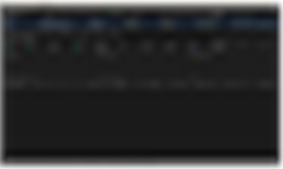

**V5 — PE (puts)** — Dashboard on a NIFTY put:

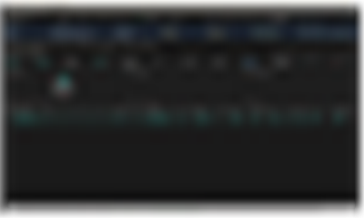

Both apps share the same UI and trading rules. Each has its own instrument and constraints. You can run one desk or both.

## Screenshots

Same UI on V4 and V5. Captures below are from live NIFTY desks (toolbar / tabs from the CE window).

**Toolbar** — Load History, bar radios **1m / 2m / 3m / 5m**, Excel, **Allow trades**, Hybrid2:

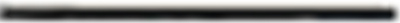

**Dashboard** — today’s session after the business day starts (weekday IST 09:00); empty until the first trade. Weekend keeps the last completed day. **All days** still shows every loaded session:

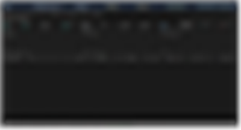

**Grid** — minute candles, Hybrid stamps, Live Market pane:

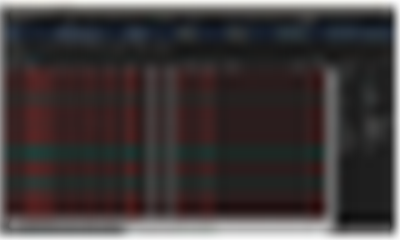

**Chart (V4 CE)** — OHLC (HA when checked), yellow SuperTrend, Entry / Target / SL, ▲/▼, pattern filters, bar radios 1m / 2m / 3m / 5m:

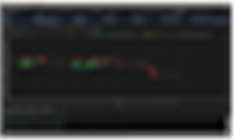

**Chart (V5 PE)** — same Hybrid2 SuperTrend on a put. Yellow line stays on the pane even when the PE band is cheap or far above premium:

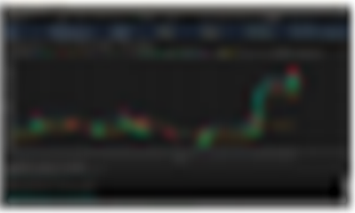

**Chart footer** — day summary + one-line trade list:

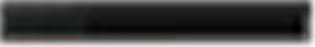

**Day profit** — every loaded session day, sized like Dashboard from starting capital:

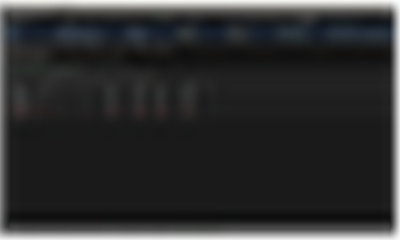

**Research** — option shortlist / apply contract:

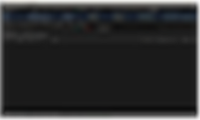

**Constants** — instrument, Hybrid knobs, **Find next-day settings**:

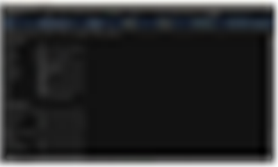

## What the desk does

- **Load History** from broker charts (current pack), then **Subscribe** for live ticks.
- **Find next-day settings** (Constants) runs the same data build, then scores Hybrid packs and offers **Apply / Cancel**. Apply locks the winner. No live orders during Load History or the search.
- Strategies: **Basic**, **Trough**, **Trail**, **Spike**, **Hybrid**, **Hybrid2**. Bar radios: **1m / 2m / 3m / 5m**.
- Hybrid2 legs: Spike, bullish Marubozu, Trough, UT Bot, HP. Chart checkboxes arm or disarm each leg. Unchecked SuperTrend drops the yellow-line filter and the SuperTrend BUY; HP is not tied to those boxes.
- Yellow SuperTrend is drawn from the **display** series (HA when Heikin Ashi is on).
- **BUY only after the signal bar closes.** Target and stop fire **on the tick** (no wait for bar close).
- **Dashboard** rolls to today at session open (weekday 09:00 IST, or as soon as today’s bars exist). It does not keep Friday’s list on a Monday morning.
- **Allow trades** (toolbar): uncheck to keep signals on the chart but **place no new Super BUY**. Open trades still exit on Target/SL.
- If price already tagged **Target** while **flat**, the desk does **not** buy (a late signal must not turn an exit into an entry).
- Planned buy price is a cap: live LIMIT, no MARKET chase above that price.
- **Day profit** lists each loaded session day’s gross / charges / net with the current pack (same ₹ sizing as Dashboard latest-day).
- **Bars between trades** (Constants) counts closed bars in the selected 1/2/3/5m size after an exit, including SuperTrend.

## Hybrid2 SuperTrend

Chart checkbox **SuperTrend** (yellow). Visual bull/bear uses the candles you see (HA when that box is on).

| Situation | What the desk does |
|-----------|-------------------|
| SuperTrend is **bullish** and the yellow line is **touching or below** the bars | SuperTrend **BUY** if flat (after the bars-between gap). One open trade. After an exit, it may re-enter if ST is still bullish. |
| Yellow line **touching or below** the bars | Spike / Marubozu / Trough / UT Bot may enter (their own stamps). |
| **No open trade** and the yellow line **comes down** through the bars | SuperTrend **BUY**. **Stop = yellow SuperTrend line** (rides the line while open). **Target** = SuperTrend / AI / TpPct. |
| Yellow line fully **above** the displayed bars | No SuperTrend BUY. Do not enter while HA/price is still under the line. |
| **HP** prints or touches while a Hybrid2 trade is open | Exit that trade, no matter which leg opened it (including Super Order). |

Uncheck SuperTrend to drop the yellow line and the SuperTrend entry; other Hybrid2 legs then trade without that filter. HP stays its own overlay.

Cheap **PE**: the chart still draws the SuperTrend line under the bars instead of hiding it.

## Safety switches

| Switch | Where | Effect |
|--------|--------|--------|
| **Allow trades** | Toolbar | Off = signals only, no new BUY |
| **Enable Dhan Orders** | Constants | Off = paper fills in the app, no broker |
| Broker token / proxy | Secrets tab on the desk | Stored only on the operator’s machine |

## Source

The trading git (`Kishoreinline/AlgoTrading`) is **private**. This public repo is overview and screenshots only. Visitors cannot browse the desks, clone the source, or download the private repository.
